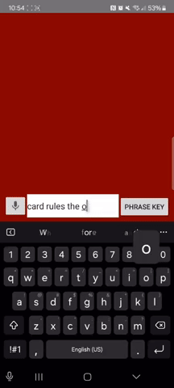

MTGChatbot (Android)

🤖 Purpose

MTGChatBot is an AI-powered chatbot designed for Magic: The Gathering players. The app provides users with general card information, set availability, and card rulings and interactions. It uses the public Scryfall API to retrieve real-time data. Users can interact using both text and voice input, allowing hands-free access to MTG card knowledge.

💻 Required Software

To run or edit the project, install the following:
- Android Studio: https://developer.android.com/studio?gad_source=1&gbraid=0AAAAAC-IOZkRzVkn0T9vu-nf8JLBf_Npv&gclid=CjwKCAjwn6LABhBSEiwAsNJrjsjog51mW--a_QL9c6xkyRMb3EgyC82dCQrEod5DDqDwcQY-nwiChhoC7uMQAvD_BwE&gclsrc=aw.ds
- Git: https://git-scm.com/

🛠 Project Setup

To get started, fork the repository and clone your fork:

git fork https://github.com/shama2025/MTGChatbot.git  
git clone https://github.com/YOUR-USERNAME/MTGChatbot.git  
cd MTGChatbotProject

📂 Project Structure

MTGChatbotProject/  
├── app/                                        # Android app module  
│   └── ...                                     # Contains source code, resources, manifest  
├── gradle/                                     # Gradle wrapper files  
├── .gitignore                                  # Ignored files  
├── README.md                                   # Project documentation  
├── build.gradle.kts                            # Top-level Gradle config  
├── gradle.properties                           # Project settings  
├── gradlew / gradlew.bat                       # Gradle wrapper scripts  
├── settings.gradle.kts                         # Module settings  
├── src/  
│   ├── main/  
│   │   ├── java/com/mashaffer/mymtgchatbot/    # App logic (Kotlin)  
│   │   └── res/                                # Resources (layouts, drawables, etc.)  
│   │       ├── drawable/                       # App icons and images  
│   │       │   └── ic_launcher-playstore.png  
│   │       ├── layout/                         # UI XML layouts  
│   │       ├── values/                         # Strings, colors, themes  
│   │       └── ...                             # Other resources  
│   ├── androidTest/                            # UI tests  
│   ├── test/                                   # Unit tests  
├── AndroidManifest.xml                         # App manifest

Your main and res directories house the Kotlin source code and XML layout files needed to update the functionality and views.

🔊 Voice Input Support

MTGChatBot supports voice-based card search. With microphone permission enabled, the app transcribes speech into text and uses it to query the Scryfall API. No audio is recorded or stored — it’s used only for real-time search purposes.

▶️ Running the App

To run the app:

1. Open the project in Android Studio.  
2. Create an Android Virtual Device (AVD): https://developer.android.com/studio/run/managing-avds  
   OR connect your Android phone: https://developer.android.com/codelabs/basic-android-kotlin-compose-connect-device#0  
3. Click the green Run ▶️ button at the top of Android Studio.

After building, your app should look something like this:

📩 Support

For questions, bugs, or feature requests, open an issue:  
https://github.com/shama2025/MTGChatbot/issues

🔐 Privacy

Voice input is used for transcription only. We do not store or transmit your audio. All MTG data is fetched securely via Scryfall’s public API. See the full privacy policy:  
https://github.com/shama2025/MTGChatbot/blob/main/PRIVACY.md

© 2025 Marcus Shaffer
